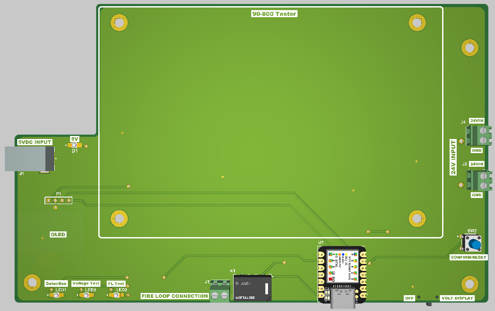

# 90-800 Tester Development (104252)
---
End of Project: September 2023 ; Continue to make improvement

Completed: Production team have requested to have confirmation button on the Top side.  This change has made on Rev A4.  Board not ordered yet.

Update: Op-Amp, TVS, Zener, Series Resistor, capacitor for the voltage measurement for 24VDC (Revision R5)
---
#### Instruction for T-867
1. Plug in 5V power supply to the left-hand side of the tester.
2.	Wait until display shows "Waiting for Power"
3.	Place device under test on top of the tester using two screws diagonally. Make sure that the rocker switch of the device under test is in OFF position.
4.	Make connections from the tester to the device under test (Input of the transformer, output of the transformer, Fire Loop, Voltage Output 1, and Voltage Output 2 Connection)
5.	Lastly, insert the main AC plug into the device.
6.	Turn on the AC main switch.
7.	Switch ON the rocker switch. This will initiate the testing process.
8.	The tester display will show the Voltage Output measurements. Adjust the output voltage via potentiometer to 24VDC (23 - 25VDC). Push the confirm button located on the right bottom side of the tester.
9.	The tester will go through Fire Loop functionality test next and upon completion, the tester will display the result.
10.	If the display shows "Test Good", turn off the AC power switch and remove the AC power connection from the device under test.
11.	Remove other wire connections and remove the device under test.

Note:
- If the output voltage potentiometer is not within the range, the tester may not be able to detec the power presense and sit in the "Waiting for Power" state.  Adjust the voltage to acceptable level using potentiometer with rocker switch on until voltage measurement shows on the display.
- This has changed to 10V for detection.
---
#### Altium Project File
 - [Project File](https://detex-corporation.365.altium.com/designs/327D70DE-DD06-426B-8618-25C8A5CFA4D7#design)
 - Based on Seeed Studio XIAO SAMD21 Board [Link](https://www.seeedstudio.com/Seeeduino-XIAO-Arduino-Microcontroller-SAMD21-Cortex-M0+-p-4426.html?utm_source=blog&utm_medium=blog)
 - [Datasheet](https://files.seeedstudio.com/wiki/Seeeduino-XIAO/res/ATSAMD21G18A-MU-Datasheet.pdf)
 - To program this micro, short the pads twice to put the device into programming mode

---
#### Tester Development Note
- Tester is utilizing the 11-800 Logic Controller Enclosure and trandformer.
- [Custom made PCB mount](3D Model/tester_with_cutout.3mf) that fits inside this enclosure 
- Using 3M screws as default
- 90 Degree 5V 5.5mm X 2.5mm US Plug
- 5V 1A power Adapter(typically used for LED strip etc)
  - [Used on this project](https://www.amazon.com/dp/B0C1NNZH87?psc=1&ref=ppx_yo2ov_dt_b_product_details)
    
---

### Bootloader for XIAO

- [Bootloader](https://github.com/Seeed-Studio/ArduinoCore-samd/blob/master/bootloaders/XIAOM0/bootloader-XIAO_m0-v3.7.0-33-g90ff611-dirty.bin)
- [Wiki](https://wiki.seeedstudio.com/Software-SWD/)
- [Tutoriak](https://embeddedcomputing.weebly.com/seeeduino-xiao-m0.html)
- [Xiao Expansion Board](https://embeddedcomputing.weebly.com/the-5-programmer-debugger.html)
- SWDIO and SWCLK are located on the bottom side of the board

